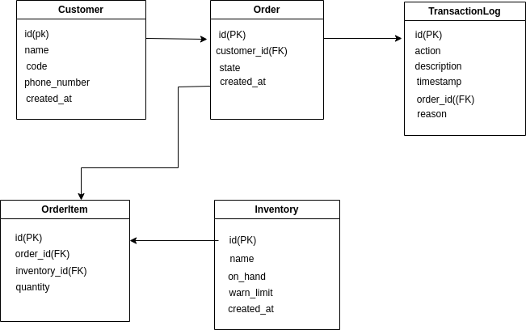

# Backend Challenge Application

This is a Flask-based backend application for managing customers and orders. The application uses SQLite for the database and Africa’s Talking API for sending SMS notifications.It also integrates OpenID authentication for secure login.

## Features
- JWT-based authentication for secure access to API endpoints
- OpenID authentication for user login.
- CRUD operations for customers and orders
- SMS notifications using Africa's Talking API
- Unit tests with pytest and coverage reporting
- CI/CD ready with GitHub Actions
- Inventory Management: Track available stock, low stock, and out-of-stock items.
- Order Management: Create and approve orders, with detailed logs of transaction actions.

## ER diagram
  To understand the database schema, refer to the ER Diagram that illustrates the relationships between the models such as Customer, Order, Inventory, and TransactionLog.
 

## Requirements
- Python 3.8+
- SQLite
- Africa’s Talking API credentials
- OpenID credentials (for OpenID authentication)

## Setup Instructions
1. Clone the repository:
   - git clone git@github.com:smsharon/backend.git
   - cd backend
2. Install dependancies:
   - pip install -r requirements.txt
3. Set up the database:
   - python -m flask db init
   - python -m flask db migrate
   - python -m flask db upgrade
4. Run the application:
   - python app/app.py
5. Run the tests:
   - pytest --cov=app tests/

## API Endpoints
- Authentication
   POST /login: Logs in a customer using OpenID authentication and returns a JWT token.
- Customers
   POST /customers: Adds a new customer (protected).
- Orders
   POST /orders: Adds a new order and sends an SMS notification (protected).
   PUT /orders/{order_id}/approve: Approves an order (protected endpoint).
   GET /orders: Retrieves all orders for the authenticated customer.

## Licence
- MIT

   
   
  
